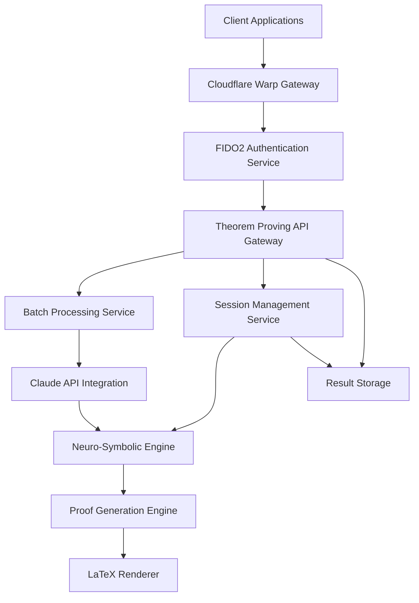

# Design Document: Theorem Proving Interface

## Overview

The theorem proving interface provides a secure, scalable API for automated theorem proving within the Meta-Optimized Hybrid Neuro-Symbolic Reasoning Framework. The design integrates LaTeX mathematical notation processing, Claude API for enhanced reasoning, batch processing capabilities, and enterprise-grade security through Cloudflare Warp and FIDO2 authentication.

## Architecture

### High-Level Architecture



### Service Architecture

The system follows a microservices architecture with the following core services:

1. **API Gateway Service** - Main entry point handling routing and request validation
2. **Authentication Service** - FIDO2/WebAuthn integration with YubiKey support
3. **Session Management Service** - Manages proof sessions and state
4. **Batch Processing Service** - Handles multiple theorem processing
5. **Claude Integration Service** - Interfaces with Claude API for enhanced reasoning
6. **Neuro-Symbolic Engine** - Core reasoning engine
7. **LaTeX Processing Service** - Mathematical notation parsing and rendering
8. **Result Storage Service** - Persistent storage for proofs and sessions

## Components and Interfaces

### API Gateway Service

**Primary Interface: TheoremProvingAPI**

```swift
protocol TheoremProvingAPI {
    func submitTheorem(_ theorem: LaTeXTheorem, config: ProofConfig) async throws -> ProofSession
    func submitBatch(_ theorems: [LaTeXTheorem], config: BatchConfig) async throws -> BatchSession
    func getSessionStatus(_ sessionId: UUID) async throws -> SessionStatus
    func getBatchStatus(_ batchId: UUID) async throws -> BatchStatus
    func getProofResult(_ sessionId: UUID) async throws -> ProofResult
    func cancelSession(_ sessionId: UUID) async throws -> CancellationResult
    func verifyProof(_ theorem: LaTeXTheorem, proof: ProofSteps) async throws -> VerificationResult
}
```

**Request/Response Models:**

```swift
struct LaTeXTheorem {
    let statement: String // LaTeX mathematical notation
    let context: [String]? // Optional axioms or definitions
    let metadata: TheoremMetadata
}

struct ProofConfig {
    let timeout: TimeInterval
    let maxDepth: Int
    let strategy: ReasoningStrategy // neural, symbolic, balanced
    let confidenceThreshold: Double
}

struct ProofResult {
    let status: ProofStatus // proven, disproven, timeout
    let steps: [ProofStep]?
    let counterexample: String?
    let confidence: Double
    let renderableLatex: String // Markdown-compatible LaTeX
}
```

### Authentication Service

**FIDO2 Integration:**

```swift
protocol AuthenticationService {
    func initiateAuthentication() async throws -> AuthenticationChallenge
    func completeAuthentication(_ response: AuthenticatorResponse) async throws -> AuthToken
    func validateToken(_ token: AuthToken) async throws -> Bool
    func refreshToken(_ token: AuthToken) async throws -> AuthToken
}

struct AuthToken {
    let accessToken: String
    let refreshToken: String
    let expiresAt: Date
    let scope: [Permission]
}
```

### Batch Processing Service

**Claude API Integration:**

```swift
protocol BatchProcessor {
    func processBatch(_ batch: BatchRequest) async throws -> BatchSession
    func getClaudeAnalysis(_ theorem: LaTeXTheorem) async throws -> ClaudeInsight
    func parallelProcess(_ theorems: [LaTeXTheorem]) async throws -> [ProofResult]
}

struct ClaudeInsight {
    let reasoning: String
    let suggestedApproach: ReasoningStrategy
    let complexity: ComplexityLevel
    let relatedTheorems: [String]
}
```

### LaTeX Processing Service

**Mathematical Notation Handling:**

```swift
protocol LaTeXProcessor {
    func parseLatex(_ input: String) async throws -> ParsedExpression
    func validateSyntax(_ latex: String) async throws -> ValidationResult
    func renderToMarkdown(_ latex: String) async throws -> String
    func extractSymbols(_ expression: ParsedExpression) -> [MathSymbol]
}

struct ParsedExpression {
    let ast: ExpressionTree
    let symbols: [MathSymbol]
    let operators: [LogicalOperator]
    let quantifiers: [Quantifier]
}
```

## Data Models

### Core Data Structures

```swift
// Session Management
struct ProofSession {
    let id: UUID
    let theorem: LaTeXTheorem
    let config: ProofConfig
    let status: SessionStatus
    let createdAt: Date
    let updatedAt: Date
    let userId: String
}

enum SessionStatus {
    case queued
    case processing(progress: Double)
    case completed(result: ProofResult)
    case failed(error: ProofError)
    case cancelled
}

// Batch Processing
struct BatchSession {
    let id: UUID
    let sessions: [ProofSession]
    let overallStatus: BatchStatus
    let completedCount: Int
    let totalCount: Int
}

// Proof Representation
struct ProofStep {
    let stepNumber: Int
    let rule: InferenceRule
    let premises: [String]
    let conclusion: String
    let justification: String
    let confidence: Double
}
```

### Storage Schema

**Session Storage (Redis/DynamoDB):**
- Session metadata and status
- Temporary proof state
- User authentication tokens

**Result Storage (PostgreSQL/DocumentDB):**
- Completed proofs with full traces
- Theorem library and relationships
- User proof history and analytics

## Error Handling

### Error Classification

```swift
enum TheoremProvingError: Error {
    case authenticationFailed(reason: AuthFailureReason)
    case invalidLatex(syntax: String, position: Int)
    case proofTimeout(partialResult: ProofResult?)
    case claudeAPIError(statusCode: Int, message: String)
    case resourceExhausted(type: ResourceType)
    case sessionNotFound(sessionId: UUID)
    case batchProcessingFailed(failedSessions: [UUID])
}

enum AuthFailureReason {
    case invalidToken
    case expiredToken
    case fidoVerificationFailed
    case rateLimitExceeded
    case cloudflareBlocked
}
```

### Error Response Format

```json
{
  "error": {
    "code": "INVALID_LATEX",
    "message": "LaTeX syntax error at position 15",
    "details": {
      "position": 15,
      "expected": "closing brace",
      "suggestion": "Add '}' after '\\frac{1}{2'"
    },
    "requestId": "req_123456789"
  }
}
```

## Testing Strategy

### Unit Testing

- **LaTeX Parser Tests**: Validate mathematical notation parsing
- **Authentication Tests**: FIDO2 flow and token management
- **Proof Engine Tests**: Core reasoning logic validation
- **Claude Integration Tests**: API interaction and response handling

### Integration Testing

- **End-to-End Proof Flow**: Submit theorem → Process → Retrieve result
- **Batch Processing Tests**: Multiple theorem handling and parallel processing
- **Security Tests**: Authentication flows and authorization checks
- **Performance Tests**: Load testing with concurrent sessions

### Test Data Strategy

```swift
struct TestTheorems {
    static let simple = LaTeXTheorem(
        statement: "\\forall x \\in \\mathbb{R}: x^2 \\geq 0",
        context: nil,
        metadata: TheoremMetadata(difficulty: .basic)
    )
    
    static let complex = LaTeXTheorem(
        statement: "\\exists! x \\in \\mathbb{C}: e^{2\\pi i x} = 1 \\land x \\neq 0",
        context: ["Complex analysis axioms"],
        metadata: TheoremMetadata(difficulty: .advanced)
    )
}
```

### Security Testing

- **FIDO2 Authentication**: Hardware token integration testing
- **Cloudflare Warp**: Tunnel security and access control
- **Rate Limiting**: API abuse prevention
- **Input Validation**: LaTeX injection and malformed input handling

## Performance Considerations

### Scalability Design

- **Horizontal Scaling**: Stateless services with load balancing
- **Caching Strategy**: Redis for session state, CDN for static LaTeX renders
- **Queue Management**: Async processing with priority queues for batch jobs
- **Resource Management**: CPU/memory limits per proof session

### Claude API Optimization

- **Request Batching**: Combine multiple theorem analyses
- **Response Caching**: Cache Claude insights for similar theorems
- **Rate Limit Management**: Intelligent backoff and retry strategies
- **Cost Optimization**: Balance Claude usage with local processing

### LaTeX Rendering Performance

- **Precompiled Templates**: Common mathematical expressions
- **Incremental Rendering**: Update only changed portions
- **Client-Side Caching**: Browser cache for rendered expressions
- **CDN Distribution**: Global LaTeX asset delivery

## Monitoring and Observability

### Metrics Collection

```swift
protocol MetricsCollector {
    func recordProofDuration(_ duration: TimeInterval, complexity: ComplexityLevel)
    func recordClaudeAPILatency(_ latency: TimeInterval)
    func recordConcurrentSessions(_ count: Int)
    func recordErrorRate(_ rate: Double, errorType: TheoremProvingError)
}
```

### Distributed Tracing

- **Request Tracing**: End-to-end proof session tracking
- **Service Correlation**: Cross-service request correlation IDs
- **Performance Profiling**: Bottleneck identification in reasoning pipeline
- **Error Attribution**: Precise error source identification

### Health Checks and Alerting

```swift
struct SystemHealth {
    let cpuUsage: Double
    let memoryUsage: Double
    let activeProofSessions: Int
    let claudeAPIStatus: ServiceStatus
    let neuralEngineStatus: ServiceStatus
    let queueDepth: Int
}
```

## Security Architecture

### Threat Model

- **Input Validation**: LaTeX injection and malformed expression attacks
- **Authentication Bypass**: FIDO2 token spoofing and session hijacking
- **Resource Exhaustion**: DoS via computationally expensive theorems
- **Data Exfiltration**: Unauthorized access to proof results and user data

### Security Boundaries

```swift
protocol SecurityValidator {
    func validateLatexInput(_ input: String) throws -> SanitizedInput
    func enforceRateLimit(for userId: String) throws
    func auditSecurityEvent(_ event: SecurityEvent)
    func encryptSensitiveData(_ data: Data) throws -> EncryptedData
}
```

### Zero-Trust Architecture

- **Service-to-Service Authentication**: mTLS between all internal services
- **Principle of Least Privilege**: Minimal permissions for each service
- **Network Segmentation**: Isolated subnets for different service tiers
- **Continuous Verification**: Real-time security posture assessment